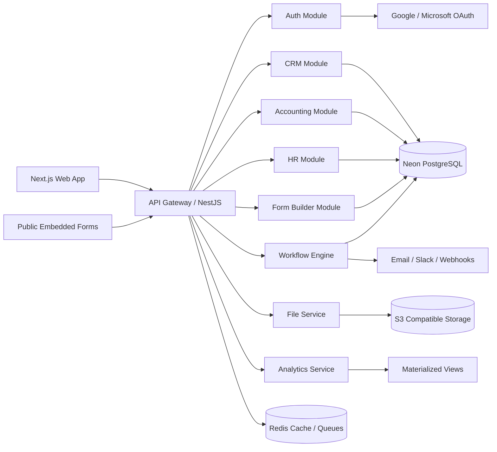

# System Architecture

## Platform view

## Tenancy and security model

- Single database, shared schema, tenant isolation enforced by `tenantId`.
- JWT access tokens with refresh token rotation.
- OAuth support for Google and Microsoft identity providers.
- RBAC plus field-level access policies on sensitive data like payroll and financial entries.
- Audit log events for reads, writes, exports, approvals, and automation actions.

## Module boundaries

- `Auth`: identity, sessions, SSO, invitations.
- `CRM`: contacts, companies, leads, pipelines, deals, activities, notes.
- `Accounting`: invoices, expenses, payments, reporting, tax profiles.
- `HR`: employees, leave, attendance, payroll, reviews, documents.
- `Forms`: form templates, published forms, responses, conditional logic, validation.
- `Workflow`: trigger/action orchestration with async queue workers.
- `Files`: uploads, virus scanning hook, signed URLs, attachment relationships.
- `Analytics`: widget definitions, KPIs, cached query results, dashboard layouts.

## Scale strategy

- Start with modular monolith NestJS services for velocity.
- Promote workflows, notifications, analytics, and document processing to separate workers when load grows.
- Use Redis for cache, rate limiting, job queues, and idempotency keys.
- Add read replicas and partition audit/form response tables as volume increases.

